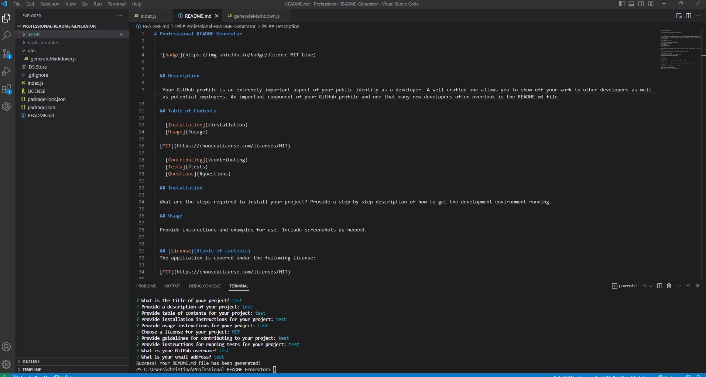

# Professional-README-Generator

  
  
    

  ## Description
  
   This project utilizes the terminal, node, inquirer and 'fs' to create a README.md using the users inputs!
   
   Your GitHub profile is an extremely important aspect of your public identity as a developer. A well-crafted one allows you to show off your work to other developers as well as potential employers. An important component of your GitHub profile—and one that many new developers often overlook—is the README.md file.
  
  ## Table of Contents
  
  - [Installation](#installation)
  - [Usage](#usage)
  
  [MIT](https://choosealicense.com/licenses/MIT)
    
  - [Contributing](#contributing)
  - [Tests](#tests)
  - [Questions](#questions)
  
  ## Installation
  
   Type "npm i inquirer" into the terminal.
  
  ## Usage
  
  Type "node index" into the terminal after installing inquirer.

  ## Screenshot
  

  ## Video Demo
 [Untitled_ Feb 27, 2023 3_18 PM.webm](https://user-images.githubusercontent.com/119627874/221679617-e6054d07-588c-4002-a208-6c7e8d741136.webm)
  
  ## [License](#table-of-contents)
  The application is covered under the following license:
  
  [MIT](https://choosealicense.com/licenses/MIT)
    
    
  
  ## Contributing
  
  There were no contributors for this project at this time
  
  ## Tests
  
  No tests have been done
  
  ## Questions
  
  If you have any questions, please feel free to contact me:
  
  - Email: christina.e.c.barberi@gmail.com
  - GitHub: [Christinaecb](https://github.com/Christinaecb)
